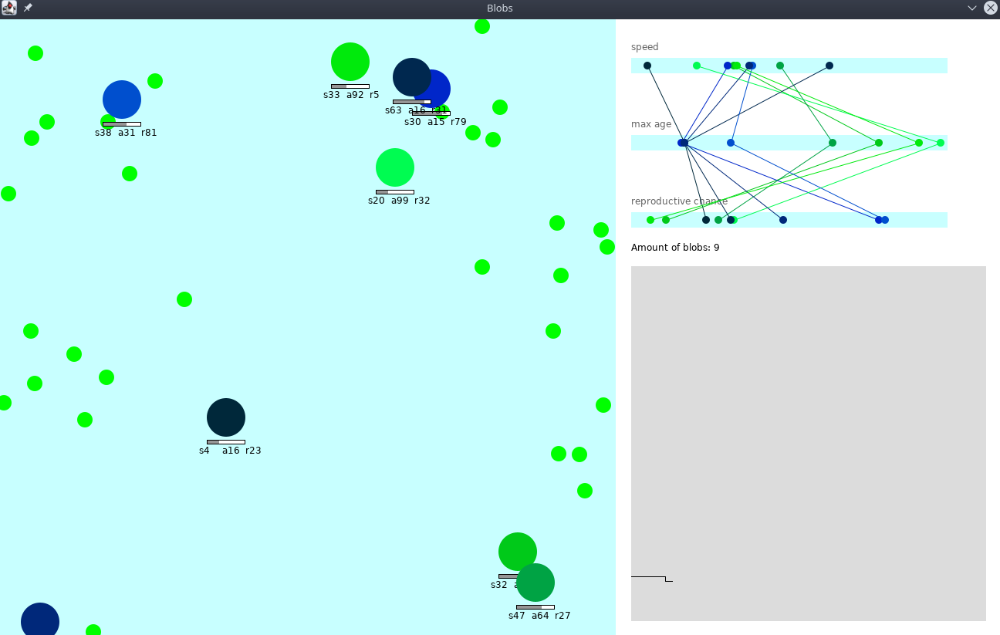

# Blobs

A Java evolution simulator with “blobs”, which are little circles with different traits (speed, max age and reproductive chance) that determine their color. Each time a blob duplicates it passes on it’s traits with small mutations. Watch your blobs evolve into the ultimate race.




## How to Run

```
java -jar blobs.jar
```

## License

This project is licensed under the MIT License - see the [LICENSE](LICENSE) file for details)